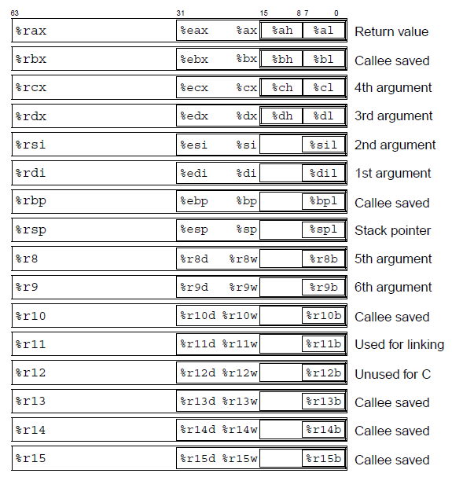

## Bomb Lab

> 题意解析：
>
> 有一个编译不了的c文件bomb.c，和一个目标代码文件bomb
>
> 当运行bomb文件的时候，它会要求我们输入六个字符串，如果有一个是错的那么炸弹就会爆炸（程序无法正常退出）
>
> 
>
> 以第一个炸弹为例
>
> /* Hmm...  Six phases must be more secure than one phase! */
>
> ​    input = read_line();             /* Get input                   */
>
> ​    phase_1(input);                  /* Run the phase               */
>
> ​    phase_defused();                 /* Drat!  They figured it out!
>
> ​                      \* Let me know how they did it. */
>
> ​    printf("Phase 1 defused. How about the next one?\n");
>
> phase_1就是一个我们无法从c文件分析的一个函数，我们只知道将我们输入的字符串传入了进去，但是不知道它内部运行情况，所以一旦我们输入的字符串不对，这个函数可能就无法正常退出，我们也就拆除失败了
>
> 
>
> 但是给我们bomb可执行文件了，说明这个可执行文件肯定是能成功执行的（即炸弹都完全拆除了）
>
> 
>
> 思路：就是利用反汇编工具逆向分析这个bomb可执行文件中的六个炸弹函数phase，找到这6个字符串从而拆除炸弹

[BombLab参考资料--知乎](https://zhuanlan.zhihu.com/p/472178808)

x86-64寄存器：



思路：反汇编可执行文件bomb然后分析汇编代码，找出相应的字符串--使用gdb调试器进行

```
//以gdb加载bomb可执行文件
gdb bomb

//设置断点
(gdb) break phase_1
Breakpoint 1 at 0x400ee0
(gdb) break phase_2
Breakpoint 2 at 0x400efc
(gdb) break phase_3
Breakpoint 3 at 0x400f43
(gdb) break phase_4
Breakpoint 4 at 0x40100c
(gdb) break phase_5
Breakpoint 5 at 0x401062
(gdb) break phase_6
Breakpoint 6 at 0x4010f4

//开始反汇编
(gdb) disassemble phase_1

```

### phase_1

反汇编后的汇编文件：

```asm
Dump of assembler code for function phase_1:
   0x0000000000400ee0 <+0>:     sub    $0x8,%rsp
   0x0000000000400ee4 <+4>:     mov    $0x402400,%esi
   0x0000000000400ee9 <+9>:     call   0x401338 <strings_not_equal>
   0x0000000000400eee <+14>:    test   %eax,%eax
   0x0000000000400ef0 <+16>:    je     0x400ef7 <phase_1+23>
   0x0000000000400ef2 <+18>:    call   0x40143a <explode_bomb>
   0x0000000000400ef7 <+23>:    add    $0x8,%rsp
   0x0000000000400efb <+27>:    ret    
End of assembler dump.
```

解析这个函数：

看上面贴的x86-64图

我们知道%rsi传递的是第二个参数

%eax为函数返回值

这个汇编用到了test和je指令

```
第一行：从%rsp减去8字节，这里是在栈上分配空间
第二行：将立即数0x402400移动到寄存器%esi
第三行：call   0x401338 <strings_not_equal>  调用这个函数，从字面分析，这个函数就是比较字符串相不相同，返回值应该保存在%eax中
第四行：test指令执行一个逻辑与的操作，如果%eax为0,那么结果为0,这时零标志ZF就会变成1,反之%eax非零，ZF就会变成0
第五行：je指令用来检查是否相等，如果相等就跳转到je后面的地址，实际上检查的是零标志ZF，ZF=1跳转

根据后面推断<strings_not_equal>函数应该是返回值为0就跳转到结束，即拆除成功
```

然后分析就知道这是一个字符串比较函数，我们传进来一个参数，那么我们解析%rsi第二个参数就知道目标字符串了

```
(gdb) x/s 0x402400
0x402400:       "Border relations with Canada have never been better."

x/s指令：x：检查，s：以字符串形式解析，所以这个指令的意思就是解析目标地址上的数据并显示，以字符串的形式进行上述操作
```


### phase_2

```asm
(gdb) disassemble phase_2
Dump of assembler code for function phase_2:
   0x0000000000400efc <+0>:     push   %rbp
   0x0000000000400efd <+1>:     push   %rbx
   0x0000000000400efe <+2>:     sub    $0x28,%rsp
   0x0000000000400f02 <+6>:     mov    %rsp,%rsi
   0x0000000000400f05 <+9>:     call   0x40145c <read_six_numbers>
   0x0000000000400f0a <+14>:    cmpl   $0x1,(%rsp)
   0x0000000000400f0e <+18>:    je     0x400f30 <phase_2+52>
   0x0000000000400f10 <+20>:    call   0x40143a <explode_bomb>
   0x0000000000400f15 <+25>:    jmp    0x400f30 <phase_2+52>
   0x0000000000400f17 <+27>:    mov    -0x4(%rbx),%eax
   0x0000000000400f1a <+30>:    add    %eax,%eax
   0x0000000000400f1c <+32>:    cmp    %eax,(%rbx)
   0x0000000000400f1e <+34>:    je     0x400f25 <phase_2+41>
   0x0000000000400f20 <+36>:    call   0x40143a <explode_bomb>
   0x0000000000400f25 <+41>:    add    $0x4,%rbx
   0x0000000000400f29 <+45>:    cmp    %rbp,%rbx
   0x0000000000400f2c <+48>:    jne    0x400f17 <phase_2+27>
   0x0000000000400f2e <+50>:    jmp    0x400f3c <phase_2+64>
   0x0000000000400f30 <+52>:    lea    0x4(%rsp),%rbx
   0x0000000000400f35 <+57>:    lea    0x18(%rsp),%rbp
   0x0000000000400f3a <+62>:    jmp    0x400f17 <phase_2+27>
   0x0000000000400f3c <+64>:    add    $0x28,%rsp
   0x0000000000400f40 <+68>:    pop    %rbx
   0x0000000000400f41 <+69>:    pop    %rbp
   0x0000000000400f42 <+70>:    ret    
End of assembler dump.
```

解析：

```
前两行在操作Callee Register，保存里面的值，不用管
第三行：分配栈帧
第四行：将%rsp（栈指针）存储的内存地址复制到%rsi（第二个参数）
第五行：调用<read_six_numbers>函数，猜测这个函数好像是在读取6个数字，由下文推断，应该是将我们输入的6个数字保存在了%rsi（即栈指针）开始的地址处，所以从栈指针往下6个数字就是我们的目标！！！
第六行：cmpl   $0x1,(%rsp)，应该是比较1和第一个数字，结合第七行je如果相等就跳转越过炸弹跳转，所以第一个数字为1！！！！

跳转：lea    0x4(%rsp),%rbx，%rsp+4为第二个数字处，将第二个数字的开始指针存入了%rbx
lea    0x18(%rsp),%rbp %rsp再+24（注意这里的18为16进制），将6个数字结束的指针位置存入了%rbp
下一行：jmp无条件跳转

然后里面的逻辑就很简单了，这里直接给出2-6的数字： 2,4,8,16,32
0x0000000000400f25 <+41>:    add    $0x4,%rbx注意这一行是让%rbx指向下一个元素
```

所以答案为

```
1 2 4 8 16 32
```

注意这里需要区分：**内存引用（将寄存器里面的值解析为一个内存地址，然后去这个内存地址上的值）和寄存器的区别**

%rbx存储的是指向第几个元素的指针，即寄存器中存储的值

（%rbx）是去读取存储在%rbx中的那个地址对应的那个数字


### phase_3

一个switch语句的汇编

```asm
(gdb) disassemble phase_3
Dump of assembler code for function phase_3:
   0x0000000000400f43 <+0>:     sub    $0x18,%rsp
   #将%rsp+12的位置存入了%rcx（第四个参数：这里应该是用来存储第二个值的地址）
   0x0000000000400f47 <+4>:     lea    0xc(%rsp),%rcx
   #将%rsp+8的位置存入了%rdx（第三个参数，这里应该是用来存储第一个值的地址）
   0x0000000000400f4c <+9>:     lea    0x8(%rsp),%rdx
   #第二个参数%esi（通过分析这里的地址我们可以知道需要让我们传入两个整数）
   0x0000000000400f51 <+14>:    mov    $0x4025cf,%esi
   
   #这里应该是有没有传递两个参数进入，如果没有那么就会爆炸
   0x0000000000400f56 <+19>:    mov    $0x0,%eax
   0x0000000000400f5b <+24>:    call   0x400bf0 <__isoc99_sscanf@plt>
   0x0000000000400f60 <+29>:    cmp    $0x1,%eax
   0x0000000000400f63 <+32>:    jg     0x400f6a <phase_3+39>
   #%eax >1就跳转(应该跳转)
   0x0000000000400f65 <+34>:    call   0x40143a <explode_bomb>
   
   
   0x0000000000400f6a <+39>:    cmpl   $0x7,0x8(%rsp)
   0x0000000000400f6f <+44>:    ja     0x400fad <phase_3+106>
   #对比%rsp+8的值和7,这时应该不跳转，应该是%rsp+8 <=7（这里可以知道我们传入的第一个值应该在0-7之间，并且包括边界）
   0x0000000000400f71 <+46>:    mov    0x8(%rsp),%eax
   #%eax存储的值是%rsp+8存储的值
   
   
   #下面是一个switch语句
   0x0000000000400f75 <+50>:    jmp    *0x402470(,%rax,8)
   #207
   0x0000000000400f7c <+57>:    mov    $0xcf,%eax
   0x0000000000400f81 <+62>:    jmp    0x400fbe <phase_3+123>
   #707
   0x0000000000400f83 <+64>:    mov    $0x2c3,%eax
   0x0000000000400f88 <+69>:    jmp    0x400fbe <phase_3+123>
   #256
   0x0000000000400f8a <+71>:    mov    $0x100,%eax
   0x0000000000400f8f <+76>:    jmp    0x400fbe <phase_3+123>
   #389
   0x0000000000400f91 <+78>:    mov    $0x185,%eax
   0x0000000000400f96 <+83>:    jmp    0x400fbe <phase_3+123>
   #206
   0x0000000000400f98 <+85>:    mov    $0xce,%eax
   0x0000000000400f9d <+90>:    jmp    0x400fbe <phase_3+123>
   #682
   0x0000000000400f9f <+92>:    mov    $0x2aa,%eax
   0x0000000000400fa4 <+97>:    jmp    0x400fbe <phase_3+123>
   #327
   0x0000000000400fa6 <+99>:    mov    $0x147,%eax
   0x0000000000400fab <+104>:   jmp    0x400fbe <phase_3+123>
   #这里是default分值，如果填的值太大炸弹就会爆炸
   0x0000000000400fad <+106>:   call   0x40143a <explode_bomb>
   0x0000000000400fb2 <+111>:   mov    $0x0,%eax
   0x0000000000400fb7 <+116>:   jmp    0x400fbe <phase_3+123>
   #118
   0x0000000000400fb9 <+118>:   mov    $0x137,%eax
   
   
   #最终检查点：比较%rsp+12（第二个参数）与%eax是否相等，如果相等就安全返回了，所以这里我们可以分析，我们需要传入一个
   0x0000000000400fbe <+123>:   cmp    0xc(%rsp),%eax
   0x0000000000400fc2 <+127>:   je     0x400fc9 <phase_3+134>
   0x0000000000400fc4 <+129>:   call   0x40143a <explode_bomb>
   0x0000000000400fc9 <+134>:   add    $0x18,%rsp
   0x0000000000400fcd <+138>:   ret    
End of assembler dump.
```

查看 0x4025cf位置可以知道我们需要传递两个int类型的整数进去

```
(gdb) x/s 0x4025cf
0x4025cf:       "%d %d"
```

总上我们分析出来，我们需要传入两个int，第一个int需要指明switch的索引，第二个int需要对应刚才索引的switch的值


一个参考答案：

```
0 207
```


### phase_4

```asm
(gdb) disassemble phase_4
Dump of assembler code for function phase_4:
   0x000000000040100c <+0>:     sub    $0x18,%rsp
   #依旧%rsp+12为第二个参数的位置
   0x0000000000401010 <+4>:     lea    0xc(%rsp),%rcx
   #依旧%rsp+8为第一个参数的位置
   0x0000000000401015 <+9>:     lea    0x8(%rsp),%rdx
   #这个题也是传入两个int类型的参数
   0x000000000040101a <+14>:    mov    $0x4025cf,%esi
   #依旧检查是不是两个参数，如果不是两个参数直接爆炸
   0x000000000040101f <+19>:    mov    $0x0,%eax
   0x0000000000401024 <+24>:    call   0x400bf0 <__isoc99_sscanf@plt>
   0x0000000000401029 <+29>:    cmp    $0x2,%eax
   0x000000000040102c <+32>:    jne    0x401035 <phase_4+41>
   
   #如果第一个参数<=14那么就跳转（这里应该跳转），>14就爆炸
   0x000000000040102e <+34>:    cmpl   $0xe,0x8(%rsp)
   0x0000000000401033 <+39>:    jbe    0x40103a <phase_4+46>
   0x0000000000401035 <+41>:    call   0x40143a <explode_bomb>
   
   #这里开始调用func，14为第三个参数，0为第二个参数，刚才传入的第一个参数为func的第一个参数
   0x000000000040103a <+46>:    mov    $0xe,%edx
   0x000000000040103f <+51>:    mov    $0x0,%esi
   0x0000000000401044 <+56>:    mov    0x8(%rsp),%edi
   0x0000000000401048 <+60>:    call   0x400fce <func4>
   #检查#eax是不是0,是0就跳转，这里其实不应该跳转
   0x000000000040104d <+65>:    test   %eax,%eax
   0x000000000040104f <+67>:    jne    0x401058 <phase_4+76>
   #比较第二个参数和0,如果相等就跳转结束程序
   0x0000000000401051 <+69>:    cmpl   $0x0,0xc(%rsp)
   0x0000000000401056 <+74>:    je     0x40105d <phase_4+81>
   0x0000000000401058 <+76>:    call   0x40143a <explode_bomb>
   0x000000000040105d <+81>:    add    $0x18,%rsp
   0x0000000000401061 <+85>:    ret    
End of assembler dump.
```

经过分析，我们只能分析出来第一个参数应该<=14，**第二个参数为0**

信息不够我们还应该继续反汇编func4，看看里面发生了什么

```asm
(gdb) disassemble func4
#%edx初始14,%esi初始0,%edi是我们反求的参数
Dump of assembler code for function func4:
   0x0000000000400fce <+0>:     sub    $0x8,%rsp
   #%eax = %edx
   0x0000000000400fd2 <+4>:     mov    %edx,%eax
   #%eax = %eax - %esi
   0x0000000000400fd4 <+6>:     sub    %esi,%eax
   #%ecx = %eax
   0x0000000000400fd6 <+8>:     mov    %eax,%ecx
   #%ecx向逻辑右移31位，%ecx只剩下符号位，为0/1
   0x0000000000400fd8 <+10>:    shr    $0x1f,%ecx
   #%eax = %eax + %ecx
   0x0000000000400fdb <+13>:    add    %ecx,%eax
   #%eax算术右移1位，即%eax = %eax/2
   0x0000000000400fdd <+15>:    sar    %eax
   #%ecx = %rax + %rsi
   0x0000000000400fdf <+17>:    lea    (%rax,%rsi,1),%ecx
   0x0000000000400fe2 <+20>:    cmp    %edi,%ecx
   #如果#ecx<=%edi就跳转到+36,否则继续执行
   0x0000000000400fe4 <+22>:    jle    0x400ff2 <func4+36>
   #%edx = %rcx-1
   0x0000000000400fe6 <+24>:    lea    -0x1(%rcx),%edx
   #递归
   0x0000000000400fe9 <+27>:    call   0x400fce <func4>
   0x0000000000400fee <+32>:    add    %eax,%eax
   0x0000000000400ff0 <+34>:    jmp    0x401007 <func4+57>
   0x0000000000400ff2 <+36>:    mov    $0x0,%eax
   0x0000000000400ff7 <+41>:    cmp    %edi,%ecx
   0x0000000000400ff9 <+43>:    jge    0x401007 <func4+57>
   0x0000000000400ffb <+45>:    lea    0x1(%rcx),%esi
   0x0000000000400ffe <+48>:    call   0x400fce <func4>
   0x0000000000401003 <+53>:    lea    0x1(%rax,%rax,1),%eax
   0x0000000000401007 <+57>:    add    $0x8,%rsp
   0x000000000040100b <+61>:    ret    
End of assembler dump.
```

注意这里rax与eax其实是一个，其余的都这么类推

这种复杂的一般都反写出c代码--然后我们就发现这有点

然后上面我们知道应该返回值为0,所以我们应该反推出应该最外层循环是edi == ecx，根据初始值就能推断出edi=7,所以**第一个参数为7**

```c
void funt4(int edi,int esi,int edx){//edi待求,esi = 0，edx=14
   	int eax = (((edx - esi)>>31)+edx-esi)/2;
    int ecx = eax + esi;
    if(ecx > edi){
        edx = ecx-1;
        return func4(edi,esi,ecx-1)*2;
    }else if (ecx < edi){
     esi = ecx +1;
     return func4(edi,ecx+1,edx)*2+1;   
    }else return 0;    
}
```

答案：

```
7 0
```


### phase_5

```asm
(gdb) disassemble phase_5
Dump of assembler code for function phase_5:
   0x0000000000401062 <+0>:     push   %rbx
   #文件开始
   0x0000000000401063 <+1>:     sub    $0x20,%rsp
   #%rbx = %rdi(第一个参数) 
   0x0000000000401067 <+5>:     mov    %rdi,%rbx
   
   #%rax = 段寄存器上偏移8字节的内存内容--这里是在读取线程局部的金丝雀值
   0x000000000040106a <+8>:     mov    %fs:0x28,%rax
   #%rsp +24 = %rax--把刚才读到的金丝雀值读到栈上
   0x0000000000401073 <+17>:    mov    %rax,0x18(%rsp)
   
   #%eax = %eax^%eax--把%eax清零
   0x0000000000401078 <+22>:    xor    %eax,%eax
   #计算字符串长度string_length，传进去的是%rdi指向的字符串，以%eax返回字符串长度
   0x000000000040107a <+24>:    call   0x40131b <string_length>
   #如果%eax（字符串长度） = 6那么就跳转，如果不是那么就爆炸
   0x000000000040107f <+29>:    cmp    $0x6,%eax
   0x0000000000401082 <+32>:    je     0x4010d2 <phase_5+112>
   0x0000000000401084 <+34>:    call   0x40143a <explode_bomb>
   0x0000000000401089 <+39>:    jmp    0x4010d2 <phase_5+112>
   
#这一部分结束我们得到，金丝雀值保存在%rsp+24的地方，%rbx保存着长度为6的字符串
   
   
   # %ecx = %rbx+%rax --把第%rax个字符复制给%ecx
   0x000000000040108b <+41>:    movzbl (%rbx,%rax,1),%ecx
   #%ecx存的字符写入栈
   0x000000000040108f <+45>:    mov    %cl,(%rsp)
   #%rdx保存字符串的一个字符
   0x0000000000401092 <+48>:    mov    (%rsp),%rdx
   #只保留这个字符的低四位到rdx中
   0x0000000000401096 <+52>:    and    $0xf,%edx
   #这里将刚才的字符作为索引，访问0x4024b0里面的在这个索引的字符，然后给他复制到%rdx
   #这里直接给出这个地址的字符串
   #"maduiersnfotvbylSo you think you can stop the bomb with ctrl-c, do you?"
   0x0000000000401099 <+55>:    movzbl 0x4024b0(%rdx),%edx
   #将刚才得到的字符存在%rsp的栈中，第一个字符存储在&rsp+0x10的地方
   0x00000000004010a0 <+62>:    mov    %dl,0x10(%rsp,%rax,1)
   #%rax为计数器，每轮循环+1，一共循环6轮（因为字符串只有6个）
   0x00000000004010a4 <+66>:    add    $0x1,%rax
   0x00000000004010a8 <+70>:    cmp    $0x6,%rax
   0x00000000004010ac <+74>:    jne    0x40108b <phase_5+41>
#这一部分我们使用刚才输入的字符串来进行操作，选中目标地址中的6个字符串写入栈%rsp+0x10开始的地方
   
   #%rsp+0x16 = 0
   0x00000000004010ae <+76>:    movb   $0x0,0x16(%rsp)
   #%esi（第二个参数） = "flyers"（下面这个地址保存的字符串）
   0x00000000004010b3 <+81>:    mov    $0x40245e,%esi
   #下面这几行是判断栈上刚才获取的字符和"flyers"相不相同，如果相同就跳转，这里只能让它跳转不然后爆炸了
   0x00000000004010b8 <+86>:    lea    0x10(%rsp),%rdi
   0x00000000004010bd <+91>:    call   0x401338 <strings_not_equal>
   0x00000000004010c2 <+96>:    test   %eax,%eax
   0x00000000004010c4 <+98>:    je     0x4010d9 <phase_5+119>
   0x00000000004010c6 <+100>:   call   0x40143a <explode_bomb>
   
   0x00000000004010cb <+105>:   nopl   0x0(%rax,%rax,1)
   0x00000000004010d0 <+110>:   jmp    0x4010d9 <phase_5+119>
   
   # %eax = 0,下面这两行就是eax清零操作
   0x00000000004010d2 <+112>:   mov    $0x0,%eax
   0x00000000004010d7 <+117>:   jmp    0x40108b <phase_5+41>
   
   #%rax = 刚才保存的金丝雀值
   0x00000000004010d9 <+119>:   mov    0x18(%rsp),%rax
   #看看金丝雀值有没有变化，如果没变就结束
   0x00000000004010de <+124>:   xor    %fs:0x28,%rax
   0x00000000004010e7 <+133>:   je     0x4010ee <phase_5+140>
   0x00000000004010e9 <+135>:   call   0x400b30 <__stack_chk_fail@plt>
   0x00000000004010ee <+140>:   add    $0x20,%rsp
   0x00000000004010f2 <+144>:   pop    %rbx
   0x00000000004010f3 <+145>:   ret    
End of assembler dump.
```

思路：从头捋完这个题我们就知道了我们需要用，"flyers"找到"maduiersnfotvbylSo you think you can stop the bomb with ctrl-c, do you?"对应的六个字符，然后我们是用初始的六个字符的低四位作为ASCII码来找到这六个字符的，所以思路就比较清晰了

低四位表示的范围只能是16个，所以我们只拿出上面长字符串的16个字符来分析就可以了

maduiersnfotvbyl

对应的低四位：

f：9 ->1001

l：15->1111

y：14->1110

e：5->0101

r：6->0110

s：7->0111

然后我们根据a的ASCII为97--0110 0001来推断对应的初始字符串可以得到答案为

```
ionefg
```


### phase_6

```asm
(gdb) disassemble phase_6
Dump of assembler code for function phase_6:
   0x00000000004010f4 <+0>:     push   %r14
   0x00000000004010f6 <+2>:     push   %r13
   0x00000000004010f8 <+4>:     push   %r12
   0x00000000004010fa <+6>:     push   %rbp
   0x00000000004010fb <+7>:     push   %rbx
   0x00000000004010fc <+8>:     sub    $0x50,%rsp
   
   #程序从这里开始
   # %r13 = %rsp（栈指针）--把栈指针保存在r13寄存器中（这里的目的就是持久保存）
   0x0000000000401100 <+12>:    mov    %rsp,%r13
   # %rsi（第二个参数） = %rsp--把栈指针保存在第二个参数这里
   0x0000000000401103 <+15>:    mov    %rsp,%rsi
   #感觉这个函数就是将第一个参数的6个数字写入到栈中，第一个参数很可能是我们传入的参数
   0x0000000000401106 <+18>:    call   0x40145c <read_six_numbers>
   
   #%r14 = %rsp（栈指针）
   0x000000000040110b <+23>:    mov    %rsp,%r14
   #r12d = 0
   0x000000000040110e <+26>:    mov    $0x0,%r12d
   #%rbp = %r13（栈指针）
   0x0000000000401114 <+32>:    mov    %r13,%rbp
   #%eax = （%r13）+1,读取六个元素中的第一个元素
   0x0000000000401117 <+35>:    mov    0x0(%r13),%eax
   #%eax = %eax - 1,然后和5比较，如果<=5那么就跳转到正常分支
   0x000000000040111b <+39>:    sub    $0x1,%eax
   0x000000000040111e <+42>:    cmp    $0x5,%eax
   0x0000000000401121 <+45>:    jbe    0x401128 <phase_6+52>
   0x0000000000401123 <+47>:    call   0x40143a <explode_bomb>
#上面这个我们知道了第一个元素应该<=6
   
   #%r12d+1,所以现在%r12d = 1，这两行揭示了%r12d是一个索引
   0x0000000000401128 <+52>:    add    $0x1,%r12d
   0x000000000040112c <+56>:    cmp    $0x6,%r12d
   0x0000000000401130 <+60>:    je     0x401153 <phase_6+95>
   #%ebx = %r12d----1
   0x0000000000401132 <+62>:    mov    %r12d,%ebx
   #%rax = %ebx -- 1
   0x0000000000401135 <+65>:    movslq %ebx,%rax
   # %rax = %rsp+%rax×4--访问下一个元素
   0x0000000000401138 <+68>:    mov    (%rsp,%rax,4),%eax
   #如果%rax的值不等于第一个元素那么就跳转到正常分支
#这里是个循环，这里我们知道了，第2,3,4,5,6个元素都不等于第一个元素
   0x000000000040113b <+71>:    cmp    %eax,0x0(%rbp)
   0x000000000040113e <+74>:    jne    0x401145 <phase_6+81>
   0x0000000000401140 <+76>:    call   0x40143a <explode_bomb>
   #%ebx +1 == 2
   0x0000000000401145 <+81>:    add    $0x1,%ebx
   #%ebx<=5的话就跳转
   0x0000000000401148 <+84>:    cmp    $0x5,%ebx
   0x000000000040114b <+87>:    jle    0x401135 <phase_6+65>
   
   #%r13 +4,即指向第一个元素，然后跳转到32处
   0x000000000040114d <+89>:    add    $0x4,%r13
   0x0000000000401151 <+93>:    jmp    0x401114 <phase_6+32>
#上面是一个大循环，揭示了一个就是所有元素都<=6,并且每个元素都互不相同   
   
   #%rsi（第二个参数） = 6个元素结束的地方
   0x0000000000401153 <+95>:    lea    0x18(%rsp),%rsi
   #%rax = 栈指针
   0x0000000000401158 <+100>:   mov    %r14,%rax
   #%ecx = 7
   0x000000000040115b <+103>:   mov    $0x7,%ecx
   #%edx = %ecx = 7
   0x0000000000401160 <+108>:   mov    %ecx,%edx
   #%edx = %edx - 第一个元素
   0x0000000000401162 <+110>:   sub    (%rax),%edx
   # 第一个元素 = 7 - 第一个元素
   0x0000000000401164 <+112>:   mov    %edx,(%rax)
   # %rax指向下一个元素
   0x0000000000401166 <+114>:   add    $0x4,%rax
   0x000000000040116a <+118>:   cmp    %rsi,%rax
   0x000000000040116d <+121>:   jne    0x401160 <phase_6+108>
#这里我们可以得到 所有的六个元素都变成了 7-原先的元素

   # %rsi = 0
   0x000000000040116f <+123>:   mov    $0x0,%esi
   #直接跳转到163的位置
   0x0000000000401174 <+128>:   jmp    0x401197 <phase_6+163>
   
   0x0000000000401176 <+130>:   mov    0x8(%rdx),%rdx
   0x000000000040117a <+134>:   add    $0x1,%eax
   0x000000000040117d <+137>:   cmp    %ecx,%eax
   0x000000000040117f <+139>:   jne    0x401176 <phase_6+130>
   0x0000000000401181 <+141>:   jmp    0x401188 <phase_6+148>
   #查看之后我们知道这里存储的是一个链表，这里edx指向了第一个节点
   0x0000000000401183 <+143>:   mov    $0x6032d0,%edx
   #将第number[0]个节点放到(%rsp+0x20)的位置（不一定是第一个节点）
   0x0000000000401188 <+148>:   mov    %rdx,0x20(%rsp,%rsi,2)
   #%rsi +4
   0x000000000040118d <+153>:   add    $0x4,%rsi
   0x0000000000401191 <+157>:   cmp    $0x18,%rsi
   0x0000000000401195 <+161>:   je     0x4011ab <phase_6+183>
   # %ecx = 第一个元素
   0x0000000000401197 <+163>:   mov    (%rsp,%rsi,1),%ecx
   # 比较第一个元素是否<=1，由于是最大为6，7-6=1，所以这里可以知道这里一定是跳转了
   0x000000000040119a <+166>:   cmp    $0x1,%ecx
   0x000000000040119d <+169>:   jle    0x401183 <phase_6+143>
   0x000000000040119f <+171>:   mov    $0x1,%eax
   0x00000000004011a4 <+176>:   mov    $0x6032d0,%edx
   0x00000000004011a9 <+181>:   jmp    0x401176 <phase_6+130>
#上面这个循环的意思就是把六个链表的节点搬到栈里面，这里是按照我们输入进的六个数字对链表进行的重排，也就是说不是原来的顺序了
#这里的栈里面的顺序查看下面第一张图片
   
   #%rbx 指向第number[0]个节点
   0x00000000004011ab <+183>:   mov    0x20(%rsp),%rbx
   #%rax 指向第number[1]个节点
   0x00000000004011b0 <+188>:   lea    0x28(%rsp),%rax
   #%rsi指向结束的位置
   0x00000000004011b5 <+193>:   lea    0x50(%rsp),%rsi
   #%rcx = number[0] 的节点
   0x00000000004011ba <+198>:   mov    %rbx,%rcx
   #%rdx 存储 number[1]的节点的值
   0x00000000004011bd <+201>:   mov    (%rax),%rdx
   #number[0] 的节点的next 指针 指向 number[1]的地址
   0x00000000004011c0 <+204>:   mov    %rdx,0x8(%rcx)
   #%rax 指向number[2]节点
   0x00000000004011c4 <+208>:   add    $0x8,%rax
   
   0x00000000004011c8 <+212>:   cmp    %rsi,%rax
   0x00000000004011cb <+215>:   je     0x4011d2 <phase_6+222>
   #%rcx指向number[1]
   0x00000000004011cd <+217>:   mov    %rdx,%rcx
   0x00000000004011d0 <+220>:   jmp    0x4011bd <phase_6+201>
#总结，这里是一个循环，这个循环是将链表的节点顺序按照我们内存中的顺序进行重排

   #将最后一个节点number[5]的next指向null
   0x00000000004011d2 <+222>:   movq   $0x0,0x8(%rdx)
   #%ebp = 5
   0x00000000004011da <+230>:   mov    $0x5,%ebp
   #%rax = number[0]->next == node[number[1]]
   0x00000000004011df <+235>:   mov    0x8(%rbx),%rax
   #%eax = node[number[1]]
   0x00000000004011e3 <+239>:   mov    (%rax),%eax
   #node[number[1]] <= node[number[0]]
   0x00000000004011e5 <+241>:   cmp    %eax,(%rbx)
   0x00000000004011e7 <+243>:   jge    0x4011ee <phase_6+250>
   0x00000000004011e9 <+245>:   call   0x40143a <explode_bomb>
   0x00000000004011ee <+250>:   mov    0x8(%rbx),%rbx
   0x00000000004011f2 <+254>:   sub    $0x1,%ebp
   0x00000000004011f5 <+257>:   jne    0x4011df <phase_6+235>
#这里我们知道内存中排列的结点的值是递减的   
   #这里开始程序结束
   0x00000000004011f7 <+259>:   add    $0x50,%rsp
   0x00000000004011fb <+263>:   pop    %rbx
   0x00000000004011fc <+264>:   pop    %rbp
   0x00000000004011fd <+265>:   pop    %r12
   0x00000000004011ff <+267>:   pop    %r13
   0x0000000000401201 <+269>:   pop    %r14
   0x0000000000401203 <+271>:   ret    
End of assembler dump.
```

这个是0x6032d0地址存储的东西

```
0x6032d0 <node1>:       0x0000014c      0x00000001      0x006032e0      0x00000000
0x6032e0 <node2>:       0x000000a8      0x00000002      0x006032f0      0x00000000
0x6032f0 <node3>:       0x0000039c      0x00000003      0x00603300      0x00000000
0x603300 <node4>:       0x000002b3      0x00000004      0x00603310      0x00000000
0x603310 <node5>:       0x000001dd      0x00000005      0x00603320      0x00000000
0x603320 <node6>:       0x000001bb      0x00000006      0x00000000      0x00000000
```


解析完了之后我们可以开始分析了：
首先将六个节点的顺序按值从大到小进行排列

node3>node4>node5>node6>node1>node2

然后内存中的顺序就是这样排列的

所以得到n[0] = 3,n[1] = 4,n[2] =5,n[3]=6,n[4]=1,n[5]=2

然后我们知道这个值是7-原先的值得到的所以原先的值应该为

 n[0] = 4,n[1] = 3,n[2] =2,n[3]=1,n[4]=6,n[5]=5

所以答案就是

```
4 3 2 1 6 5
```


成功记录！！！！

```
lyjy@Lenovo:~/CSAPP/bomb$ ./bomb
Welcome to my fiendish little bomb. You have 6 phases with
which to blow yourself up. Have a nice day!
Border relations with Canada have never been better.
Phase 1 defused. How about the next one?
1 2 4 8 16 32
That's number 2.  Keep going!
0 207
Halfway there!
7 0
So you got that one.  Try this one.
ionefg
Good work!  On to the next...
4 3 2 1 6 5
Congratulations! You've defused the bomb!
```


### 隐藏关

反汇编`phase_defused();`，只有这个函数我们没有反汇编过，所以突破口应该在这里

```asm
(gdb) disassemble phase_defused
Dump of assembler code for function phase_defused:
   0x00000000004015c4 <+0>:     sub    $0x78,%rsp
   #%rax = 金丝雀值
   0x00000000004015c8 <+4>:     mov    %fs:0x28,%rax
   #将金丝雀值存入到%rsp+0x68这个栈的位置
   0x00000000004015d1 <+13>:    mov    %rax,0x68(%rsp)
   #将%eax清空
   0x00000000004015d6 <+18>:    xor    %eax,%eax
   #将num_input_strings和6进行比较
   0x00000000004015d8 <+20>:    cmpl   $0x6,0x202181(%rip) # 0x603760 <num_input_strings>
   #如果不等就跳转到+123的位置，这样就结束了，所以不能跳转，这里就是在检查我们有没有输入六个字符串，即答完上面的六个phase
   0x00000000004015df <+27>:    jne    0x40163f <phase_defused+123>
   
   0x00000000004015e1 <+29>:    lea    0x10(%rsp),%r8
   0x00000000004015e6 <+34>:    lea    0xc(%rsp),%rcx
   0x00000000004015eb <+39>:    lea    0x8(%rsp),%rdx
   
   #0x402619:       "%d %d %s"
   0x00000000004015f0 <+44>:    mov    $0x402619,%esi
   #这里应该是前两个数字，然后开始比较，如果不一样的话就不继续了
   0x00000000004015f5 <+49>:    mov    $0x603870,%edi
   0x00000000004015fa <+54>:    call   0x400bf0 <__isoc99_sscanf@plt>
   0x00000000004015ff <+59>:    cmp    $0x3,%eax
   0x0000000000401602 <+62>:    jne    0x401635 <phase_defused+113>
   #0x402622:       "DrEvil"
   0x0000000000401604 <+64>:    mov    $0x402622,%esi
   0x0000000000401609 <+69>:    lea    0x10(%rsp),%rdi
   0x000000000040160e <+74>:    call   0x401338 <strings_not_equal>
   0x0000000000401613 <+79>:    test   %eax,%eax
   0x0000000000401615 <+81>:    jne    0x401635 <phase_defused+113>
   0x0000000000401617 <+83>:    mov    $0x4024f8,%edi
   0x000000000040161c <+88>:    call   0x400b10 <puts@plt>
   0x0000000000401621 <+93>:    mov    $0x402520,%edi
   0x0000000000401626 <+98>:    call   0x400b10 <puts@plt>
   0x000000000040162b <+103>:   mov    $0x0,%eax
   #这里发现秘密phase的函数，我们应该找寻如何进入它
   0x0000000000401630 <+108>:   call   0x401242 <secret_phase>
   0x0000000000401635 <+113>:   mov    $0x402558,%edi
   0x000000000040163a <+118>:   call   0x400b10 <puts@plt>
   0x000000000040163f <+123>:   mov    0x68(%rsp),%rax
   0x0000000000401644 <+128>:   xor    %fs:0x28,%rax
   0x000000000040164d <+137>:   je     0x401654 <phase_defused+144>
   0x000000000040164f <+139>:   call   0x400b30 <__stack_chk_fail@plt>
   0x0000000000401654 <+144>:   add    $0x78,%rsp
   0x0000000000401658 <+148>:   ret    
End of assembler dump.
```

思路：

通过分析上面的反汇编文件我们需要找到如何进入隐藏关卡

或者直接看分析就能明白了，我们需要在第四关的后面加DrEvil，然后在六个炸弹都拆除完了之后就会进入隐藏关卡


然后我们开始分析secret_phase的反汇编代码

```asm
(gdb) disassemble secret_phase
Dump of assembler code for function secret_phase:
   0x0000000000401242 <+0>:     push   %rbx
   0x0000000000401243 <+1>:     call   0x40149e <read_line>
   # %edx = 10
   0x0000000000401248 <+6>:     mov    $0xa,%edx
   # %esi = 0
   0x000000000040124d <+11>:    mov    $0x0,%esi
   # 
   0x0000000000401252 <+16>:    mov    %rax,%rdi
   0x0000000000401255 <+19>:    call   0x400bd0 <strtol@plt>
   0x000000000040125a <+24>:    mov    %rax,%rbx
   0x000000000040125d <+27>:    lea    -0x1(%rax),%eax
   0x0000000000401260 <+30>:    cmp    $0x3e8,%eax
   0x0000000000401265 <+35>:    jbe    0x40126c <secret_phase+42>
   0x0000000000401267 <+37>:    call   0x40143a <explode_bomb>
   0x000000000040126c <+42>:    mov    %ebx,%esi
   0x000000000040126e <+44>:    mov    $0x6030f0,%edi
   #这里传入了两个参数，一个是我们输入的数字，另一个是0x6030f0这个地址
   0x0000000000401273 <+49>:    call   0x401204 <fun7>
   #分析返回值和2的关系，必须相等
   0x0000000000401278 <+54>:    cmp    $0x2,%eax
   0x000000000040127b <+57>:    je     0x401282 <secret_phase+64>
   0x000000000040127d <+59>:    call   0x40143a <explode_bomb>
   0x0000000000401282 <+64>:    mov    $0x402438,%edi
   0x0000000000401287 <+69>:    call   0x400b10 <puts@plt>
   0x000000000040128c <+74>:    call   0x4015c4 <phase_defused>
   0x0000000000401291 <+79>:    pop    %rbx
   0x0000000000401292 <+80>:    ret    
End of assembler dump.
(gdb) 
```

这个汇编程序告诉我们我们输入的数字的范围需要在1到1001之间，然后将这个数字和0x6030f0这个数据结构传入到fun7之中，然后需要返回2,接下来我们需要分析这个数据结构和fun7这个函数

查看对应的地址是什么数据结构：

```
0x6030f0 <n1>:  0x0000000000000024      0x0000000000603110
0x603100 <n1+16>:       0x0000000000603130      0x0000000000000000
0x603110 <n21>: 0x0000000000000008      0x0000000000603190
0x603120 <n21+16>:      0x0000000000603150      0x0000000000000000
0x603130 <n22>: 0x0000000000000032      0x0000000000603170
0x603140 <n22+16>:      0x00000000006031b0      0x0000000000000000
0x603150 <n32>: 0x0000000000000016      0x0000000000603270
0x603160 <n32+16>:      0x0000000000603230      0x0000000000000000
0x603170 <n33>: 0x000000000000002d      0x00000000006031d0
0x603180 <n33+16>:      0x0000000000603290      0x0000000000000000
0x603190 <n31>: 0x0000000000000006      0x00000000006031f0
0x6031a0 <n31+16>:      0x0000000000603250      0x0000000000000000
0x6031b0 <n34>: 0x000000000000006b      0x0000000000603210
0x6031c0 <n34+16>:      0x00000000006032b0      0x0000000000000000
0x6031d0 <n45>: 0x0000000000000028      0x0000000000000000
0x6031e0 <n45+16>:      0x0000000000000000      0x0000000000000000
0x6031f0 <n41>: 0x0000000000000001      0x0000000000000000
0x603200 <n41+16>:      0x0000000000000000      0x0000000000000000
0x603210 <n47>: 0x0000000000000063      0x0000000000000000
0x603220 <n47+16>:      0x0000000000000000      0x0000000000000000
0x603230 <n44>: 0x0000000000000023      0x0000000000000000
0x603240 <n44+16>:      0x0000000000000000      0x0000000000000000
0x603250 <n42>: 0x0000000000000007      0x0000000000000000
0x603260 <n42+16>:      0x0000000000000000      0x0000000000000000
0x603270 <n43>: 0x0000000000000014      0x0000000000000000
0x603280 <n43+16>:      0x0000000000000000      0x0000000000000000
0x603290 <n46>: 0x000000000000002f      0x0000000000000000
0x6032a0 <n46+16>:      0x0000000000000000      0x0000000000000000
0x6032b0 <n48>: 0x00000000000003e9      0x0000000000000000
0x6032c0 <n48+16>:      0x0000000000000000      0x0000000000000000
```

每个节点按照结点值，左指针，右指针，填充去排列的，然后我们可以画出这棵树来

就是这个样子的


反汇编fun7：

```asm
Dump of assembler code for function fun7:
   0x0000000000401204 <+0>:     sub    $0x8,%rsp
   #rdi（为这个树）为0就跳转+52，
   0x0000000000401208 <+4>:     test   %rdi,%rdi
   0x000000000040120b <+7>:     je     0x401238 <fun7+52>
   #edx为rdi当前节点的元素
   0x000000000040120d <+9>:     mov    (%rdi),%edx
   #比较当前节点和我们传入的参数数字如果当前节点<=就跳转到+28
   0x000000000040120f <+11>:    cmp    %esi,%edx
   0x0000000000401211 <+13>:    jle    0x401220 <fun7+28>
   #
   0x0000000000401213 <+15>:    mov    0x8(%rdi),%rdi
   0x0000000000401217 <+19>:    call   0x401204 <fun7>
   0x000000000040121c <+24>:    add    %eax,%eax
   0x000000000040121e <+26>:    jmp    0x40123d <fun7+57>
   0x0000000000401220 <+28>:    mov    $0x0,%eax
   0x0000000000401225 <+33>:    cmp    %esi,%edx
   0x0000000000401227 <+35>:    je     0x40123d <fun7+57>
   0x0000000000401229 <+37>:    mov    0x10(%rdi),%rdi
   0x000000000040122d <+41>:    call   0x401204 <fun7>
   0x0000000000401232 <+46>:    lea    0x1(%rax,%rax,1),%eax
   0x0000000000401236 <+50>:    jmp    0x40123d <fun7+57>
   0x0000000000401238 <+52>:    mov    $0xffffffff,%eax
   0x000000000040123d <+57>:    add    $0x8,%rsp
   0x0000000000401241 <+61>:    ret    
End of assembler dump.
```

对应写出c函数

```c
int fun7(tree* tree,int esi){
    if(tree == null) return 0xfffffff;
       if(tree->val == esi) return 0;
       else if(tree->val < esi) return fun7(tree->right,esi)*2+1;//<
       else return fun7(tree->left,esi)*2; //>
    }
}
```

我们的目标就是找到esi，使其最后fun7能返回2,如果是返回2的话，从目标节点到它的父节点，那么一定是目标节点是父节点的**右节点**，然后父结点应该是根节点的左节点，这样从目标节点到根节点就会+1×2,正好得到我们想要的目标22

所以隐藏关答案

```
22
```


最终验证：完美收官！！！

```
lyjy@Lenovo:~/CSAPP/bomb$ ./bomb
Welcome to my fiendish little bomb. You have 6 phases with
which to blow yourself up. Have a nice day!
Border relations with Canada have never been better.
Phase 1 defused. How about the next one?
1 2 4 8 16 32                                       
That's number 2.  Keep going!
0 207
Halfway there!
7 0 DrEvil
So you got that one.  Try this one.
ionefg
Good work!  On to the next...
4 3 2 1 6 5
Curses, you've found the secret phase!
But finding it and solving it are quite different...
22
Wow! You've defused the secret stage!
Congratulations! You've defused the bomb!
```


