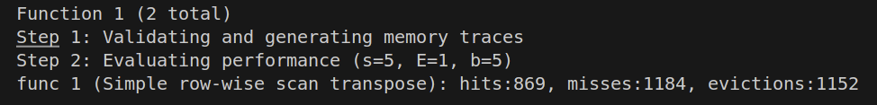
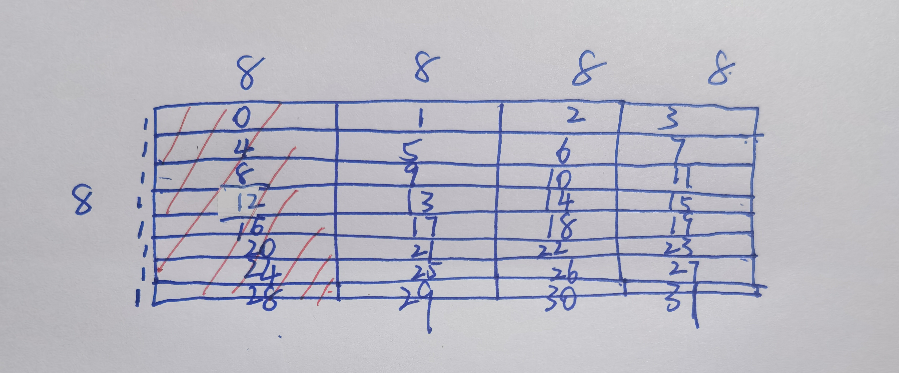
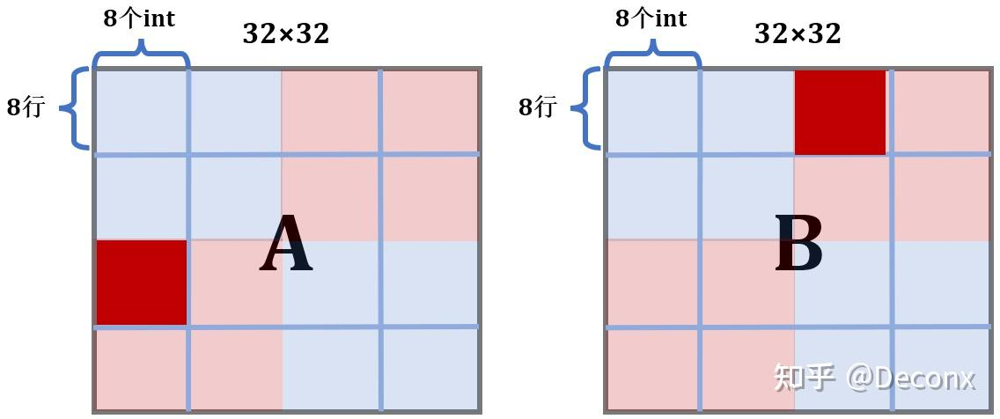
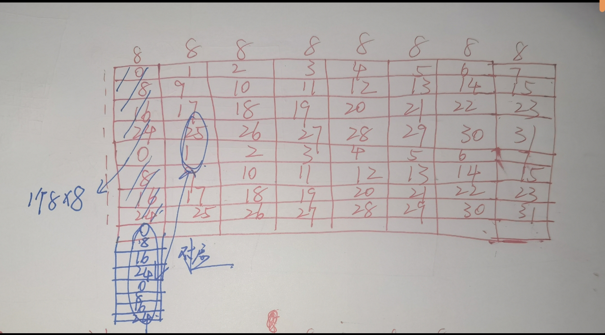
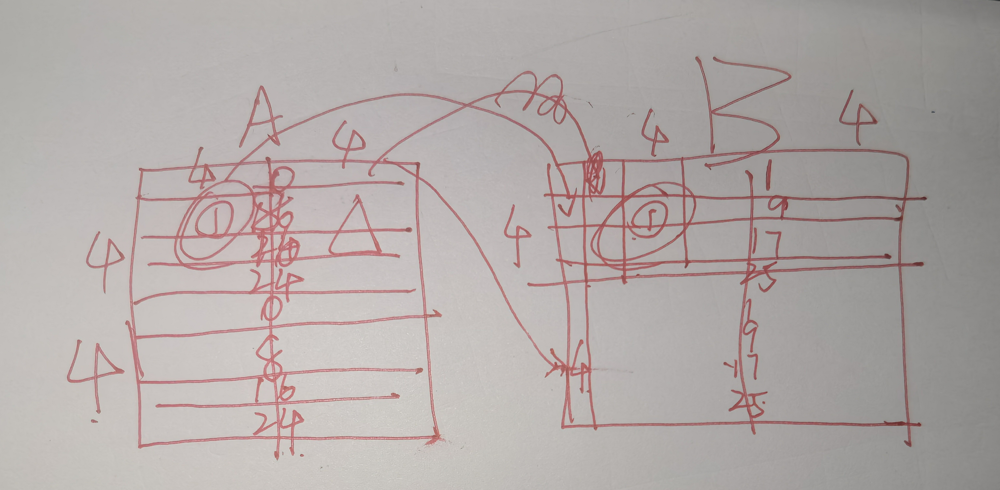

### 5:Cache Lab

> 需要操作的文件:
>
> csim.c--实现一个缓存模拟器
>
> trans.c--编写一个函数，用于计算给定矩阵的转置，要求最小化模拟缓存的未命中次数
>
> driver.py:用于评估两个文件中的正确性
>
> 
>
> 操作：
>
> 编译代码
>
> linux> make
>
> 检查模拟器的正确性：
>
> linux> ./test-csim
>
> 检查转置函数的正确性和性能：
>
> ```
> linux> ./test-trans -M 32 -N 32
> linux> ./test-trans -M 64 -N 64
> linux> ./test-trans -M 61 -N 67
> ```

[CacheLab解析--知乎](https://zhuanlan.zhihu.com/p/484657229)

#### trans.c--实现高性能矩阵转置函数--降低cache miss

> cache相关参数：
>
> cache整个大小：**1KB：**$2^{10}$=1024bytes
>
> 直接映射策略:每个set只有一个cache line
>
> cache line长度32bytes，可以容纳8个int（4bytes一个int）
>
> 所以有1024/32 = 32个set

##### 32×32优化思路：循环分块

A矩阵每8行就会占满整个cache

先分析baseline求法：每行A的cache的miss为4,每列B的miss为32，所以总miss=4×32+32×32 = 1152

和测试数据相近，说明确实是这样的



1. 优化思路0：首先是肯定按行遍历A，因为行主序，行的内存是连续的

2. 优化思路1：从B入手，因为**每次加载B进cache的时候，它一行跟着的剩下7的元素也会进入cache**，所以如果要利用这个的话，就不应该按每列32个元素这么遍历，应该每次只操作8列和其后面的元素，即**每次操作8×8的块**

3. 优化思路2：已经考虑完块内部conflict的问题，现在考虑块之间conflict的问题

   计算对应的A，B块各占用set的哪几行

   比如下面的图标红的部分：

   怎么分析：A的8行32列可以占满整个cache，如图，A表红的占用cache里面的0,4,8,12,16,20,24,28行，然后同理分析B，就是占用2,6,10,14,18,22,26,30这几行，说明**每次操作A，B对应块的时候，他们块之间是不会起冲突的**

   **但是这里注意，在A，B对角线上的块还是会起冲突的**

   

   

   前两步代码实现：

   外层两个循环用来分块，内层用来确定具体的索引，即index = 块offset+内层offset

   ```c
   void transpose_submit(int M, int N, int A[N][M], int B[M][N])
   {
       for(int i = 0;i<N;i+=8){
           for(int j =0;j<M;j+=8){
              for(int ii = 0;ii<8;ii++){
               for(int jj = 0;jj<8;jj++){
                   B[j+jj][i+ii] = A[i+ii][j+jj];
               }
              }
              
           }
       }
   }
   ```

   结果：cache misses降低到了344

   ```
   lyjy@Lenovo:~/CSAPP/cachelab/cachelab-handout$ ./test-trans -M 32 -N 32
   
   Function 0 (2 total)
   Step 1: Validating and generating memory traces
   Step 2: Evaluating performance (s=5, E=1, b=5)
   func 0 (Transpose submission): hits:1709, misses:344, evictions:312
   
   Function 1 (2 total)
   Step 1: Validating and generating memory traces
   Step 2: Evaluating performance (s=5, E=1, b=5)
   func 1 (Simple row-wise scan transpose): hits:869, misses:1184, evictions:1152
   
   Summary for official submission (func 0): correctness=1 misses=344
   
   TEST_TRANS_RESULTS=1:344
   ```

4. 优化思路3：接下来我们考虑对角线上的块

   像刚才说的，这个对角线上的块在cache上的set都是一样的

   比如都是第一个8×8块，在cache上的都是在0,4,8,12,16,20,24,28行，这就造成了冲突，为了避免这种冲突，我们选择**读完A的对角线上的块后延迟写入B块**

   具体来说就是将A的一行8个元素读取后写入临时变量，然后再写入佛如B，但是写入B的一列时候还是会有浪费，因为还是加载了后面的元素没有用上，但是已经比原来要好很多了

   ```c
   void transpose_submit(int M, int N, int A[N][M], int B[M][N])
   {
       for(int i = 0;i<N;i+=8){
           for(int j =0;j<M;j+=8){
             for(int ii = 0;ii<8;ii++){
                   int x1 = A[i+ii][j];
                   int x2 = A[i+ii][j+1];
                   int x3 = A[i+ii][j+2];
                   int x4 = A[i+ii][j+3];
                   int x5 = A[i+ii][j+4];
                   int x6 = A[i+ii][j+5];
                   int x7 = A[i+ii][j+6];
                   int x8 = A[i+ii][j+7];
                   B[j][i+ii] = x1;
                   B[j+1][i+ii] =x2;
                   B[j+2][i+ii] =x3;
                   B[j+3][i+ii] =x4;
                   B[j+4][i+ii] =x5;
                   B[j+5][i+ii] =x6;
                   B[j+6][i+ii] =x7;
                   B[j+7][i+ii] =x8;
   
             }
              
           }
       }
   }
   ```

   cache miss = 288,满分（<300就是满分了）

   ```
   Summary for official submission (func 0): correctness=1 misses=288
   ```

##### 64×64优化：

**这里复盘的时候发现，如果开个8×8的数组下面的问题全能避免！！！**

每4行就能占满整个cache

普通的cache miss为8×64+64×64 = 4608

继续采用8×8分块方案，充分利用一行的cache line，只有8×8方案才能充分利用一行cache line

但是因为矩阵大小变了，cache line的分配也变了，现在**8×8块内**会产生冲突，但是块间（除了对角线还是不会产生冲突的）



现在梳理一下8×8块中的思路：首先还是需要延迟B的写入，保证对角线上，还有就是解决块内的冲突--这里只能采用分成4个4×4的情况了

具体思路：考虑下图中这么一个块

先读取A的1块，激发了对应的0,8,16,24cache line，然后可以直接延迟将其写入B的1块，中，这是对应激发了B的1,9,17,25

然后读取A的2块的时候不能将其写入B，因为此时如果写入B，就会替换B中的cache line，所以这时不能写，用变量存储起来

然后读取A的3块，这时可以写入B的2块，因为cache line没换

然后就可以将刚才那没写入的写入B的3块了

然后4块照样写就行

这里就是多了一步用临时变量存储的这里，减少了B中cache line的替换



```c
void transpose_submit(int M, int N, int A[N][M], int B[M][N])
{
   for(int i = 0;i<N;i+=8){
    for(int j = 0;j<M;j+=8){
        int x1,x2,x3,x4,x5,x6,x7,x8 =0;
        for(int i1 = 0;i1<4;i1++){
            int x = i+i1;
            x1 = A[x][j];
            x2 = A[x][j+1];
            x3 = A[x][j+2];
            x4 = A[x][j+3];
            x5 = A[x][j+4];
            x6 = A[x][j+5];
            x7 = A[x][j+6];
            x8 = A[x][j+7];
            B[j][x] = x1;
            B[j+1][x] = x2;
            B[j+2][x] = x3;
            B[j+3][x] = x4;
            //暂时将A的2块的复制到B的2块，其实应该复制到B的3块
            B[j][x+4] = x5;
            B[j+1][x+4] = x6;
            B[j+2][x+4] = x7;
            B[j+3][x+4] = x8;
        }
        //接下来更换A的cache line,先用变量复制下B的2块，然后将A的3块替换B的2块
        //然后再把变量复制的放到B的3块--这里更换了B的cache line
        int temp[4][4];
        int r = 0;
        for(int i2 = 0;i2<4;i2++){
            temp[r][0] = B[j+i2][i+4];
            temp[r][1] = B[j+i2][i+5];
            temp[r][2] = B[j+i2][i+6];
            temp[r][3] = B[j+i2][i+7];
            r++;
            x1 = A[i+4][j+i2];
            x2 = A[i+5][j+i2];
            x3 = A[i+6][j+i2];
            x4 = A[i+7][j+i2];
            B[j+i2][i+4] = x1;
            B[j+i2][i+5] = x2;
            B[j+i2][i+6] = x3;
            B[j+i2][i+7] = x4;
        }
        int p = 0;
        for(int i3 = 4;i3<8;i3++){
            int x = i+i3;
            x5 = A[x][j+4];
            x6 = A[x][j+5];
            x7 = A[x][j+6];
            x8 = A[x][j+7];
            B[j+4][x] = x5;
            B[j+5][x] = x6;
            B[j+6][x] = x7;
            B[j+7][x] = x8;

            B[j+4+p][i+0] = temp[p][0];
            B[j+4+p][i+1] = temp[p][1];
            B[j+4+p][i+2] = temp[p][2];
            B[j+4+p][i+3] = temp[p][3];
            p++;
    
        }


    }
   }
}
```

miss直接到1206，直接通过，只不过这里开了一个数组，如果不开这个数组的话，又会造成几次cache miss

```
func 0 (Transpose submission): hits:9041, misses:1206, evictions:1174
```

##### 61×67优化：

最终版本代码，上面三个优化都能跑

所用思想：按行遍历，循环分块，延迟写入B，并且进行了边界处理

上面不用数组的原因是规定了最多只能用16个临时变量，后面用了一下数组竟然能跑这么高

**如果不是为了做题肯定采用这种方法**

分析这种做法：

读A8×8：每次读一行会产生1次cache miss，一共产生8次

写B8×8：也是8次

而且开temp数组占8个cache line，而且读写temp在块内属于完全命中的情况

为什么比第二个好：首先代码简洁是肯定的，并且使用temp增加了cache的使用率，并且去掉了繁琐的逻辑判断等等，并且第二种有的思想它全有，而且通用性也比较好，适用三种不同的情况

```c
void transpose_submit(int M, int N, int A[N][M], int B[M][N])
{
    int i, j, x, y;
    int temp[8][8];

    for (i = 0; i < N; i += 8) {
        for (j = 0; j < M; j += 8) {
            int height = (N - i) < 8 ? (N - i) : 8;
            int width = (M - j) < 8 ? (M - j) : 8;
            for (x = 0; x < height; x++) {
                for (y = 0; y < width; y++) {
                    temp[x][y] = A[i+x][j+y];
                }
            }
            for (y = 0; y < width; y++) {
                for (x = 0; x < height; x++) {
                    B[j+y][i+x] = temp[x][y];
                }
            }
        }
    }
}
```

结果：

```
Part B: Testing transpose function
Running ./test-trans -M 32 -N 32
Running ./test-trans -M 64 -N 64
Running ./test-trans -M 61 -N 67

Cache Lab summary:
                        Points   Max pts      Misses
Trans perf 32x32           8.0         8         262
Trans perf 64x64           8.0         8        1030
Trans perf 61x67          10.0        10        1726
```


#### csim.c：实现一个缓存模拟器

> cache需要的参数及其需要完成的操作：
>
> 接受命令行参数：
>
> 1. `-s <s>`：s 位 set 索引（集合数 S = 2^s）
> 2. `-E <E>`：每个 set 的行数（associativity）
> 3. `-b <b>`：块偏移位数（块大小 B = 2^b bytes）
> 4. `-t <tracefile>`：要模拟的访问 trace 文件
>
>   • -h: Optional help flag that prints usage info 
>
>   • -v: Optional verbose flag that displays trace info
>
> 需要解析的trace的格式：[space]operation address, size
>
> 1. `I`表示加载指令
> 2. `L` 加载数据
> 3. `S`存储数据
> 4. `M` 修改数据
>
> 模拟器需要做出的反馈：
>
> 不存储memory contents，不使用block offset,只需统计下面三个量的次数
>
> - `hit`：命中，表示要操作的数据在对应组的其中一行
> - `miss`：不命中，表示要操作的数据不在对应组的任何一行
> - `eviction`：驱赶，表示要操作的数据的对应组已满，进行了替换操作
>
> 要求实现的替换策略：LRU--替换最后一次访问时间最久远的那一行

思路：首先明确分为两部分，一部分用来实现cache的逻辑，一部分用来读取grace的字符串（文件操作）

首先是第一部分，我们需要明确cache需要完成一些什么工作，首先肯定是cache 搜索策略，分为cache hit和cache miss，注意这里cache miss需要有两种状态，第一种是全满，这种情况下需要计算驱逐，即替换策略，如果有空的那么就直接在空的地方替换即可

然后就是读取grace

分为三部分，operation，address，offset，后面一部分没用，因为我们不模拟offset，我们需要将address分成三部分然后实现操作


总之思路很简单

答案验证

```
lyjy@Lenovo:~/CSAPP/cachelab/cachelab-handout$ ./test-csim
                        Your simulator     Reference simulator
Points (s,E,b)    Hits  Misses  Evicts    Hits  Misses  Evicts
     3 (1,1,1)       9       8       6       9       8       6  traces/yi2.trace
     3 (4,2,4)       4       5       2       4       5       2  traces/yi.trace
     3 (2,1,4)       2       3       1       2       3       1  traces/dave.trace
     3 (2,1,3)     167      71      67     167      71      67  traces/trans.trace
     3 (2,2,3)     201      37      29     201      37      29  traces/trans.trace
     3 (2,4,3)     212      26      10     212      26      10  traces/trans.trace
     3 (5,1,5)     231       7       0     231       7       0  traces/trans.trace
     6 (5,1,5)  265189   21775   21743  265189   21775   21743  traces/long.trace
    27

TEST_CSIM_RESULTS=27
```


